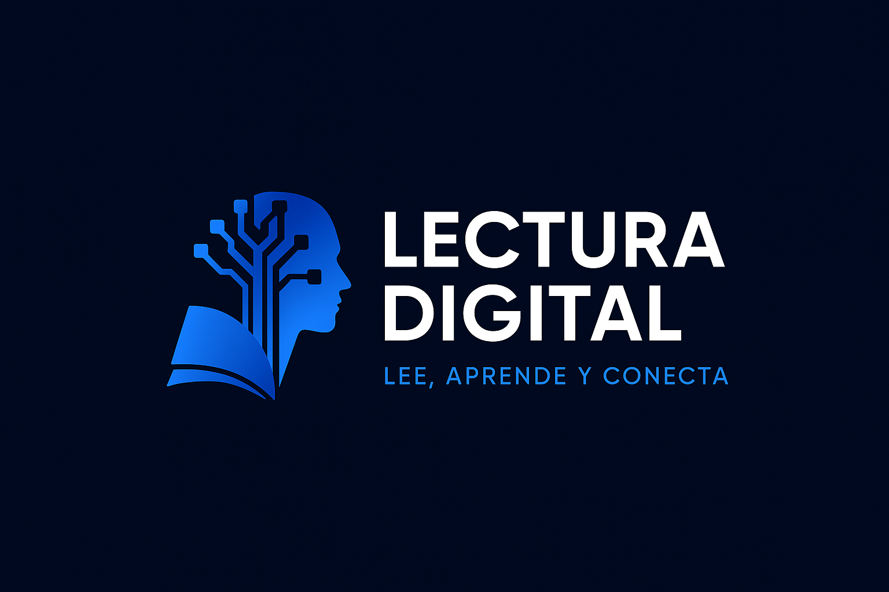

# Lectura Digital

### Lectura Digital es un proyecto que viene a innovar la manera de leer, buscando fomentar la lectura para llamar la atención de nuevos lectores y mantener enfocados a los lectores ya existentes, ofreciendo acceso rápido y cómodo a tus libros favoritos, tanto para estudiantes o fanáticos de la lectura.

### El proyecto busca dar respuesta a personas con falta de tiempo para viajar a una biblioteca, te brinda una experiencia personalizada. 

### 1. Análisis de diversas necesidades para dar un proyecto innovador.  
### 2. Planificación (elegir paletas de colores, servidores de desarrollo, bases de datos, autenticación, estructura…)
### 3. Desarrollo y evaluación (en la última fase de llevará a cabo el desarrollo de la lógica del negocio, se consumirá una API para dar un catalogo de libros…)
